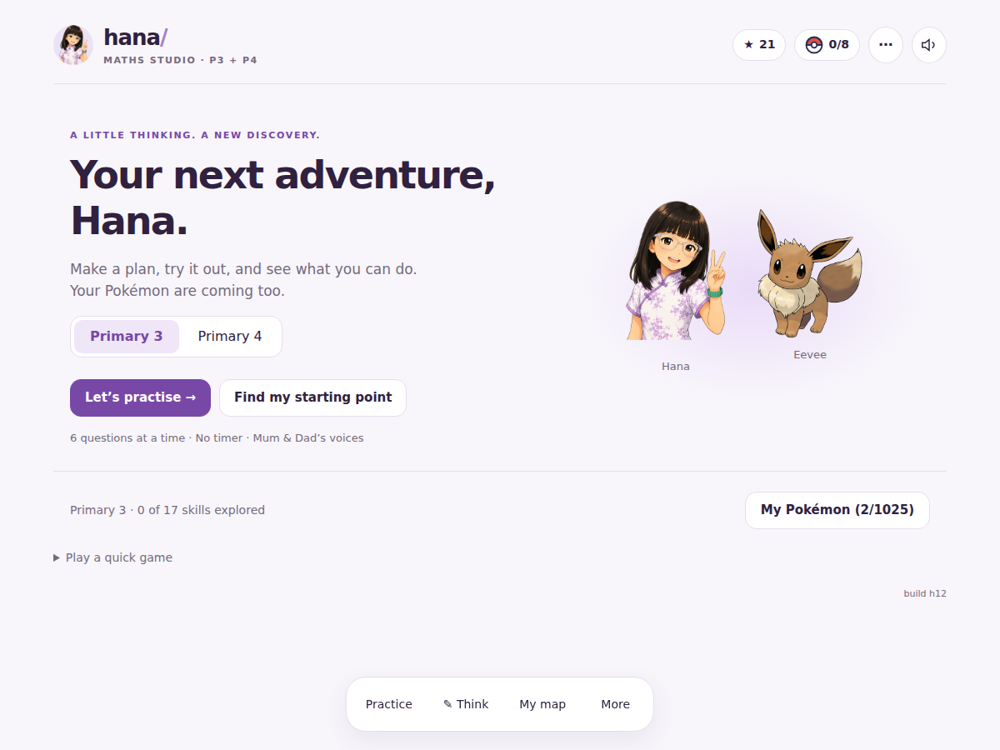

# Hana’s Maths Studio — Singapore P3 & P4

A personal maths app for Hana. **Build h12** brings Euna’s Mochi-style workspace to Hana’s existing PokéMath app: violet colours, one question at a time, optional thinking tools, a skill map and short sessions. Mum and Dad’s voices, Hana’s avatar, Pokémon collection, handwriting recognition and the existing backup/sync identity are preserved.

[Open the app](https://tallgeese84.github.io/HanaP3Math/)



## Learning

- Choose **Primary 3** or **Primary 4** explicitly. Practice never promotes a child into a different school year automatically.
- **Let’s practise** gives six questions, prioritising due review and unexplored skills. **Find my starting point** samples new skills across successive sittings. This is formative practice, not a standardised placement test.
- **My map** offers 43 skills: 18 in P3 and 25 in P4. Forty support automatic answer checking; three construction groups save work for a grown-up’s review.
- Four recent questions with at least three independent answers allow a higher tier where the question family supports larger numbers. There is no response-speed requirement. Topics with a fixed concept use varied examples within the same scope.
- “Secure” requires at least six recent observations, five independent answers, three independent answers at tier 2 or above, and evidence on two different days. It is a practice indicator, not certification that every syllabus objective is mastered.
- Hints, retries and revealed solutions are recorded separately. Supported success earns encouragement and rewards, but does not count as independent evidence. Previous stars/counters are not converted into mastery.
- Think: **Understand → Connect → Solve → Check**. Typed notes and stylus drawings remain with the question, survive closing panels and are included in backups. Paper/ruler/protractor work needs a grown-up’s check.
- Select **Next question** when ready; solutions no longer disappear on a timer.

The curriculum uses the [Singapore MOE 2021 Mathematics Syllabus, October 2025 update](https://www.moe.gov.sg/api/media/92bff26d-b2b4-4535-b868-b8415c744b91/2021-Primary-Mathematics-Syllabus-P1-to-P6-Updated-October-2025.pdf), pages 35–40. See [the review and scope notes](docs/CURRICULUM_REVIEW.md). Questions are original. This app supplements classroom teaching and practical measurement/construction.

## Family audio

`hana-voice.json` is unchanged: **62 recordings, Mum and Dad**, with Both / Dad / Mum selection and the existing greeting, praise, retry, hint, streak, catch and goodbye categories. No paid voice service or voice cloning is used. Device speech reads new question text when enabled. Recorded clips and speech use the existing sequential audio pipeline; muting now also cancels active/pending recorded playback.

More → **Mum & Dad’s voices, backup & sync** opens the original controls. TTS choices remain All / Answers only / Off. TTS Off does not disable the family clips.

## Progress, backup and offline use

Existing `hq_*` keys and the Firebase `pokequest-hana` slot remain. New per-question evidence is stored in `hq_learning`; the unfinished session in `hq_session`; selected school year in `hq_year`. Backup codes include these keys and existing rewards/settings. Cloud sync merges evidence by stable event ID; unfinished work stays local to each device. Avoid editing the same backup on old versions: old clients do not understand the new evidence fields.

Open online once to cache the app, recordings, digit model and five starter artworks. The first catch (Pikachu) and core practice work offline. Additional Pokémon artwork is cached when fetched successfully online. The service worker replaces only Hana’s own caches, preserving other family apps on the same origin.

The five bundled starter PNGs were extracted from the user-supplied `pokemon-academy-offline-official-artwork-v3-figures-fixed.zip`. The older SPERS-Sec question bank was not imported into P3/P4 practice. Pokémon names and artwork belong to Nintendo / Game Freak / The Pokémon Company. Personal, non-commercial project.

## Checks

No build step or runtime dependency is required; serve the repository as a static site.

```sh
npm test
```

The Node suite checks 38,700 generated questions, arithmetic/fraction limits, answer uniqueness, grade boundaries, diagnostic coverage, mastery/review rules, evidence merging, voice-file integrity and cache isolation.

Browser regression tests use Playwright:

```sh
npm install --no-save playwright
npx playwright install chromium
npm run test:browser
```

`tests/browser.cjs` starts its own temporary HTTP server. It exercises the real app, preserved progress, hints/retries, six-question completion, resume/working notes, input switching, desktop/tablet/phone sizing, both recorded voices, offline audio and backup contents. `PLAYWRIGHT_MODULE` and `CHROMIUM_EXECUTABLE` can point to an existing runtime installation. Tests use isolated browser storage and never access a real family Firebase account.

## Release

Bump `APP_VERSION` in `index.html`, the `h12` asset query strings and the cache name/core entries in `sw.js` together. Run the tests, update `CHANGELOG.md`, then publish via the repository’s existing GitHub Pages setup.
