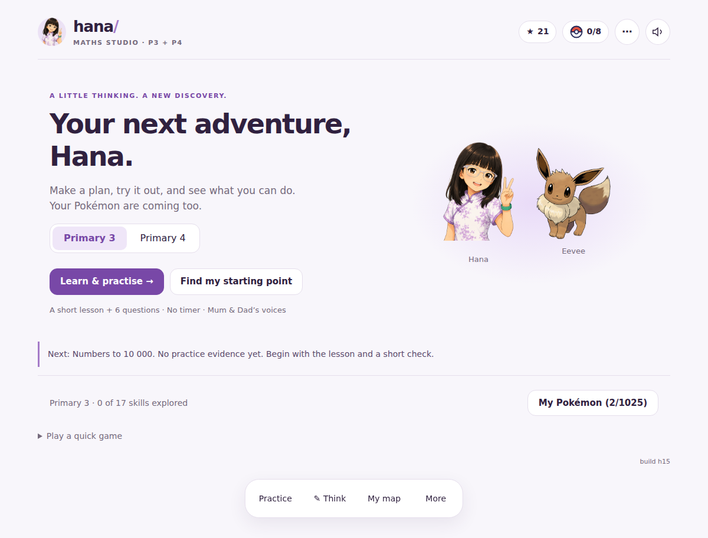

# Hana’s Maths Studio — Singapore P3 & P4

A personal maths app for Hana. **Build h23** puts settings, progress reports, the June plan and the Drive mirror behind a grown-up PIN (see *Grown-up PIN* below), keeps five-digit numbers such as 10 000 on one line, and gives Hana child-friendly next-step wording on the home screen while the parent report keeps the detailed reason. The page is marked `noindex`. **Build h22** immediately confirms settings were saved, shows upload progress, and reads the Google relay acknowledgement to distinguish a saved review, rejected credentials and uncertain delivery. Build h21 keeps unfinished mirror connection fields intact while switching apps or refreshing the progress report. The unfinished URL survives a reload in the same tab; a new secret is stored only after an explicit Save & send review. Build h20 adds private nightly priorities to the existing course preparing Hana, who is in a US Grade 3 class, to join a Singapore Primary 4 class in June 2027 (see *Road to Singapore P4* below). Priorities guide the next new session while unfinished work, due review and prerequisites remain in place. Daily priorities are data and require no daily app release. Build h15 adds Euna-style evidence, feedback and parent review: actual submitted answers, optional confidence, targeted retry prompts, changed application problems, delayed recall and clear next-step recommendations. The h14 answer-button fix remains. It retains Euna’s Mochi-style layout, visual mini-lessons and adaptive practice, with one question at a time, optional thinking tools, a skill map and short sessions. Mum and Dad’s voices, Hana’s avatar, Pokémon collection, handwriting recognition and the existing backup/sync identity are preserved.

[Open the app](https://tallgeese84.github.io/HanaP3Math/)



## Learning

- Choose **Primary 3** or **Primary 4** explicitly. Practice never promotes a child into a different school year automatically.
- **Learn & practise** introduces new skills with a short lesson: **The idea → Watch me → Your turn**. Each of the 54 mapped skills has an explanation, diagram, worked steps and a learning check, including the three drawing groups. These are introductory mini-lessons, not full classroom videos or a complete textbook.
- Daily practice focuses on one skill for four to six questions, then reviews up to two previously attempted skills. Unexplored skills and due review are prioritised; repeated difficulty can schedule an in-year prerequisite. **Find my starting point** remains a separate six-skill diagnostic without compulsory lessons; it is formative, not a standardised placement test.
- **My map** offers 54 skills: 23 in P3 and 31 in P4. Fifty-one support automatic answer checking; three construction groups save work for a grown-up’s review.
- Three consecutive independent answers at the same level raise the next question one level, up to level 3. Two consecutive supported/unsuccessful answers lower it one level. A revealed answer or two wrong attempts on one question also lowers it. There is no speed requirement. All 51 automatically checked skills change their numbers, representation or task at each level boundary.
- Repeated difficulty opens a recap before the next practice question. A missed introductory check starts practice at level 1. **Review the lesson** preserves the current question and draft, but the subsequent answer is marked as supported. Lesson checks earn no stars and create no mastery evidence. Drawing tasks remain human reviewed.
- “Remembered later” requires at least six recent questions, five independent successes in the last eight, at least three at level 2 or above, evidence on different days, a recall check at least 24 hours after prior exposure and varied question forms or an application. Recall comes before a reminder. This is an app heuristic, not certification that every syllabus objective is mastered.
- Hints, retries, lesson replays, guesses, recent exact repeats and revealed solutions are recorded separately. Supported success earns encouragement and rewards, but does not count as independent evidence. Previous stars/counters are not converted into mastery.
- Think: **Understand → Connect → Solve → Check**. Typed notes and stylus drawings remain with the question, survive closing panels and are included in backups. Paper/ruler/protractor work needs a grown-up’s check.
- Select **Next question** when ready; solutions no longer disappear on a timer.

The curriculum uses the [Singapore MOE 2021 Mathematics Syllabus, October 2025 update](https://www.moe.gov.sg/api/media/92bff26d-b2b4-4535-b868-b8415c744b91/2021-Primary-Mathematics-Syllabus-P1-to-P6-Updated-October-2025.pdf), pages 35–40. See [the review and scope notes](docs/CURRICULUM_REVIEW.md). Built-in questions are original; optional private packs contain the family’s supplied examination questions. This app supplements classroom teaching and practical measurement/construction.

## Broader exam-style practice (h19)

Normal practice and checkpoints now include 29 original question families across 37 existing skills, informed by the reviewed P3/P4 papers. These are generated locally, automatically checked and available without importing files. They add reverse problems, linked relationships, constrained answers, remainder decisions, fraction/decimal reasoning and diagrams with worked solutions.

Level 1 keeps foundations. Levels 2–3 mix the richer questions with familiar calculation practice; the existing adaptive rules still lower the level and revisit prerequisites when help is needed. Reports retain the question family and bank version for later analysis. The 62 family audio clips and existing progress are preserved. See [question bank scope and validation](docs/H19_QUESTION_BANK.md).

## Private exam papers (h18)

In **More → My exam papers**, import the three prepared JSON packs from the family's private Drive. Import once on each device. They contain 15 distinct 2025 papers (4 P3 and 11 P4), 253 original pages including keys, and 60 visually verified questions: 16 P3 and 44 P4. One duplicate source PDF was excluded. Paper content is not in this public repository.

- **Exam practice** offers short adaptive sessions in the selected year. Eligible paper questions also appear in daily/course practice, at the current difficulty. Generated questions fill gaps, so an exam pack never forces a harder level. Recent identical questions are withheld for 24 hours.
- Answers, attempts, support, confidence, paper title, question number and source page enter the normal learning record and private Drive review. Full paper images stay in this device’s IndexedDB and are excluded from progress sync and game backups.
- The original-page reader preserves every diagram and answer key. The remaining questions are available for paper-and-pencil work; the reader does not auto-grade them or add mastery. Answer-key corrections are listed with the relevant pack.
- Importing replaces a pack with the same ID, without clearing learning progress. Removing a pack only removes its local content. Browser storage deletion requires reimporting it.
- Checkpoint scores check final answers; written method marks still require a grown-up. h18 retains checkpoint drawings in reviews, corrects repair recommendations after successful reassessment, and keeps short custom schedules inside their target dates.

## Road to Singapore P4 (h17)

- **Course.** 16 units take Hana through all of P3 and P4 in school-year order (`course.js`). Each unit has planned dates spread between the start (5 Oct 2026) and the target (4 Jun 2027), keeping the last three weeks for review and Checkpoint 5. Grown-ups can change the dates and sessions per week in **More → Hana’s progress → June plan**.
- **Daily session.** **Today’s session** gives 10 questions (about 20 minutes): the next skill in the current unit (opening with its lesson), 2 word problems and 3 review questions from earlier units. A skill counts as ready after three recent independent answers, including two at level 2 or 3.
- **Word problems.** 11 skills with original Singapore-style problems (`problems.js`): level 1 shows a labelled bar model, level 2 shows the model’s shape, level 3 asks Hana to draw her own in ✎ Think.
- **Typed answers.** Fractions, mixed numbers, compound units (3 kg 45 g), remainders (12 R 3) and 24-hour times are typed into boxes instead of chosen. An equal but unsimplified fraction gets a prompt to simplify, as schools deduct a mark.
- **Checkpoints.** Five papers (`papers.js`) appear on the home screen when their unit is done or its date has passed. Format follows 2025 school papers: Section A multiple choice (1–2 marks), Section B short answer (2 marks), Section C word problems (3–5 marks) with a working canvas; 35 marks (about 45 minutes) or 54 marks (about 70 minutes). No hints or feedback until the end. Results set the next sessions automatically: missed skills are reviewed first until answered independently twice, a Section C score below 60% adds a third word problem to each session, and a score below 50% adds review.
- **Parent view.** The June plan shows on-track status against the schedule, units with planned dates, checkpoint scores by section and topic, and recommendations. Pace warnings appear only in the parent view, never on Hana’s home screen.
- Checkpoint results and the plan are saved in `hq_learning` (`papers`, `course`), sync between devices and are included in the learning review and Drive mirror (inside `learning`, so the existing relay needs no change).

`node tests/jsdom-flow.cjs` (with `npm install --no-save jsdom` and a static server on port 8765) runs a full course session, a typed-fraction retry, a complete checkpoint and the parent settings in jsdom.

## Grown-up PIN

The ⋯ settings, **More → Hana’s progress & next steps** and the June plan open only after the grown-up PIN. The first time either opens on a device, a grown-up chooses a 4–8 digit PIN and types it twice. It is stored on that device only, as a salted hash; it is not synced, mirrored or included in backups. A correct PIN unlocks for two minutes. Five wrong tries pause entry for a minute.

Forgot the PIN? Open the app address with `?reset-grownup-pin` added (for example `…/HanaP3Math/?reset-grownup-pin`), confirm, and set a new one. Learning records are not affected. This is a deterrent for children, not account security.

## Family audio

`hana-voice.json` is unchanged: **62 recordings, Mum and Dad**, with Both / Dad / Mum selection and the existing greeting, praise, retry, hint, streak, catch and goodbye categories. No paid voice service or voice cloning is used. Device speech reads question text and lesson pages when enabled. Tap **Read this aloud** on a lesson. Availability and pronunciation depend on the device’s installed speech voices; offline recordings do not require those voices. Recorded clips and speech use the existing sequential audio pipeline; muting now also cancels active/pending recorded playback.

More → **Mum & Dad’s voices, backup & sync** opens the original controls. TTS choices remain All / Answers only / Off. TTS Off does not disable the family clips.

## Progress, backup and offline use

Open **More → Hana’s progress & next steps** for today, the last seven days, the previous seven days, skill evidence, next-step reasons and recent answers/working. Download a private JSON review to share in chat, or a CSV answer log. Reports use the device timezone and identify unknown details in older history. Optional Drive mirroring requires a separate Hana relay; it is not enabled by publishing the app. See [learning review and mirror setup](docs/LEARNING-REVIEW.md).

Existing `hq_*` keys and the Firebase `pokequest-hana` slot remain. New per-question evidence and lesson completion are stored in `hq_learning`; the unfinished question or lesson slide in `hq_session`; selected school year in `hq_year`. Backup codes include these keys and existing rewards/settings. Cloud sync merges evidence and lesson checks by stable IDs, preserves newer notes and takes the latest lesson exposure; unfinished work stays local to each device. Avoid editing the same backup on old versions: old clients do not understand the new evidence fields.

Open online once to cache the app, recordings, digit model and five starter artworks. The first catch (Pikachu) and core practice work offline. Additional Pokémon artwork is cached when fetched successfully online. The service worker replaces only Hana’s own caches, preserving other family apps on the same origin.

The five bundled starter PNGs were extracted from the user-supplied `pokemon-academy-offline-official-artwork-v3-figures-fixed.zip`. The older SPERS-Sec question bank was not imported into P3/P4 practice. Pokémon names and artwork belong to Nintendo / Game Freak / The Pokémon Company. Personal, non-commercial project.

## Checks

No build step or runtime dependency is required; serve the repository as a static site.

```sh
npm test
```

The Node suite checks 38,700 generated questions, arithmetic/fraction limits, unique answers, all lesson/check definitions, real content changes at both difficulty boundaries for every automatically marked skill, rise/fall rules, year boundaries, diagnostics, mastery/review, evidence/lesson merging, voice-file integrity and cache isolation.

Browser regression tests use Playwright:

```sh
npm install --no-save playwright
npx playwright install chromium
npm run test:browser
npm run test:answers
npm run test:feedback
```

`tests/browser.cjs` starts its own temporary HTTP server. It exercises all lesson layouts at phone width, lesson reload/resume and learning checks, six-question completion with a level increase, missed-check support, reteaching, replay without losing drafts, preserved progress, working notes, input switching, both recorded voices, offline audio and backup contents. A speech adapter verifies read-aloud routing and mute; audible OS text-to-speech still needs a check on the target tablet. `PLAYWRIGHT_MODULE` and `CHROMIUM_EXECUTABLE` can point to an existing runtime installation. Tests use isolated browser storage and never access a real family Firebase account.

`tests/answer-locks.cjs` reproduces the h13 stale-lock failure and checks real touch input through keypad, stylus and keyboard transitions, wrong-answer retries, topic changes, lesson replay and resume. Unanswered choices remain tappable; completed questions cannot award twice.

`tests/feedback-browser.cjs` checks recorded answers and confidence, recovery feedback and saved working, report timezone and JSON download, mirror opt-in/privacy, delayed recall before lessons, authored applications and daily prerequisite repair. These are synthetic test records, not Hana’s real learning data.

## Release

Bump `APP_VERSION` in `index.html`, the `h15` asset query strings and the cache name/core entries in `sw.js` together. Run the tests, update `CHANGELOG.md`, then publish via the repository’s existing GitHub Pages setup.
